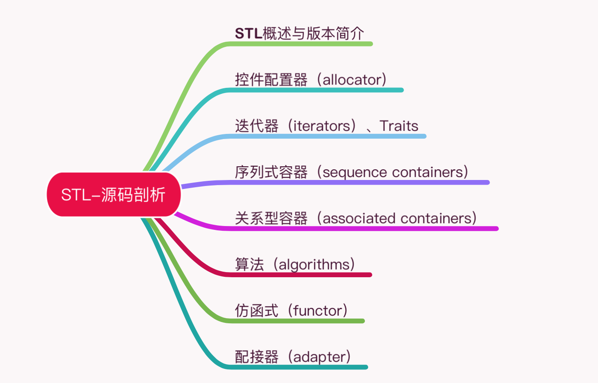
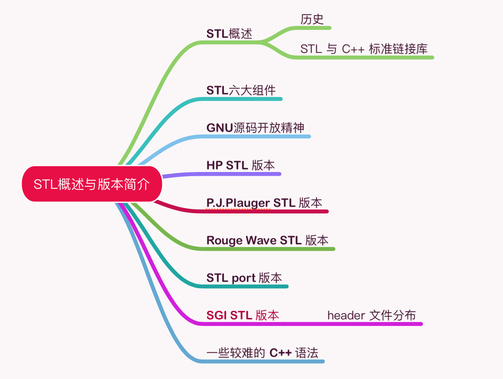
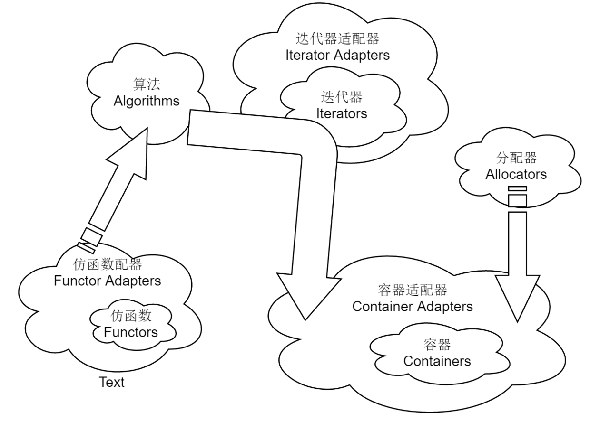
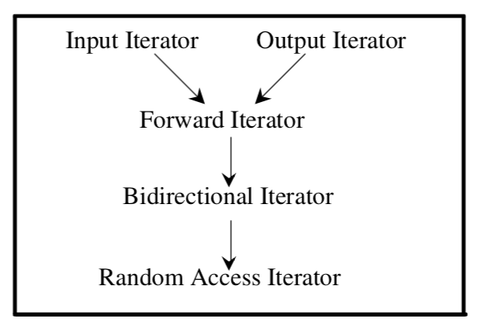
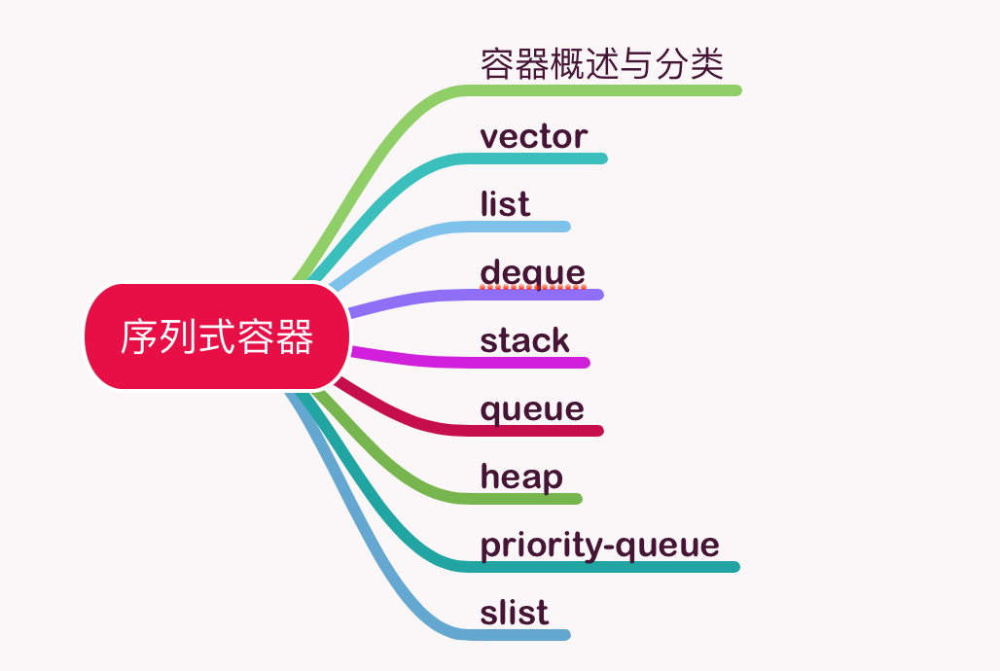
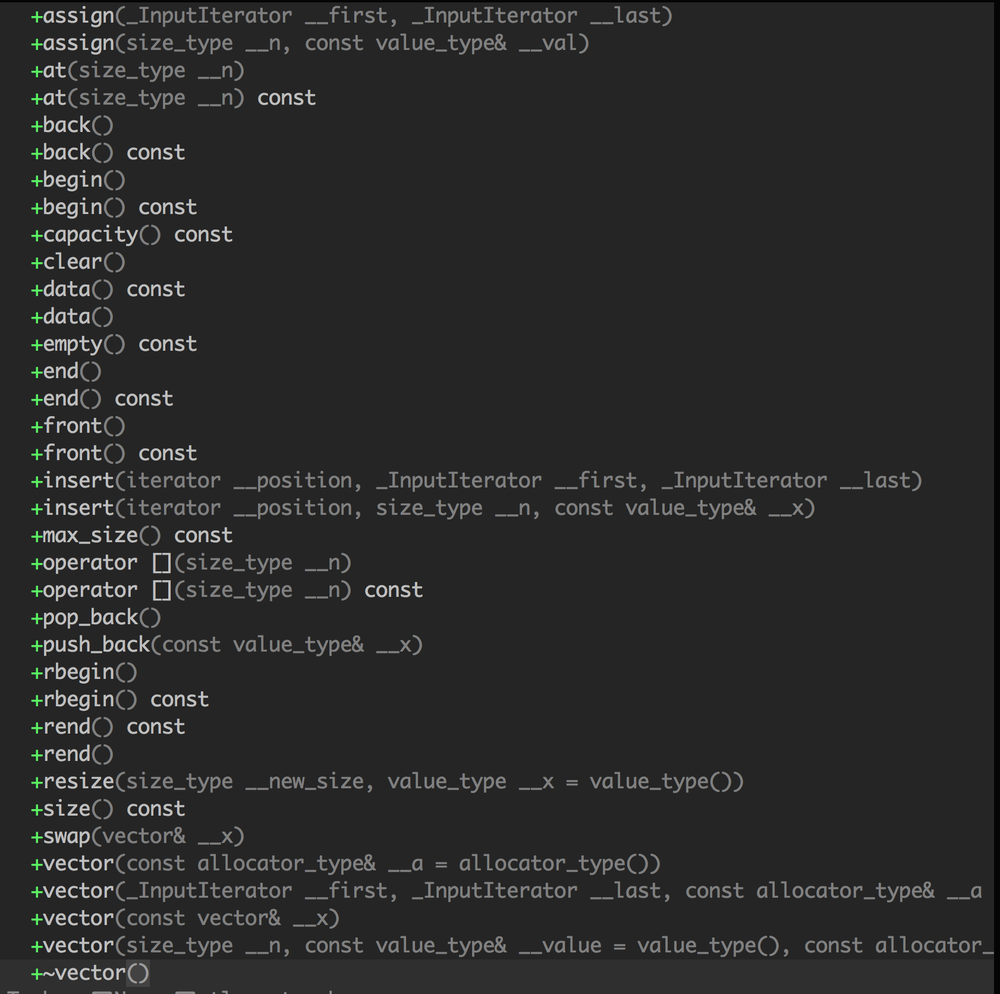

# STL 学习笔记

这是我学习 STL 的笔记。

**更新日志**

- 2019-03-04

新增了[STL 概述与版本简介](#STL 概述与版本简介)、[空间分配器（allocators）](#空间分配器（allocators）)、[迭代器（iterators）](#迭代器（iterators）)、[序列式容器-vector](#vector)

- 2019-03-05

增加了[list](#list)

# 目录

- [STL 概述与版本简介](#STL概述与版本简介)
  - [STL 的历史](#STL的历史)
  - [STL 与 C++ 标准链接库](#STL与C++标准链接库)
  - [STL 六大组件](#STL六大组件)
  - [GNU 源码开放精神](#GNU源码开放精神)
  - [HP 版本](#HP版本)
  - [SGI STL 版本](#SGI-STL版本)
- [空间分配器（allocators）](#空间分配器（allocators）)
  - [分配器的标准接口](#分配器的标准接口)
  - [设计分配器](#设计分配器)
  - [二级分配（sub-allocation）的 SGI 空间分配器](#二级分配（sub-allocation）的SGI空间分配器)
  - [内存基本处理工具](#内存基本处理工具)
- [迭代器（iterators）](#迭代器（iterators）)
  - [迭代器的设计思维——STL 的关键](#迭代器的设计思维——STL的关键)
  - [迭代器是一种 smart pointer](#迭代器是一种smart-pointer)
  - [迭代器相应类型](#迭代器相应类型)
  - [iterator 源码](#iterator源码)
- [序列式容器（sequence containers）](#序列式容器（sequence-containers）)
  - [vector](#vector)
    - [vector 的迭代器](#vector的迭代器)
    - [vector 的数据结构](#vector的数据结构)
    - [vector 的构造与内存管理 constructor, push_back](#vector的构造与内存管理constructor,push_back)
    - [vector 的元素操作 pop_back, erase, clear, insert](#vector的元素操作pop_back,erase,clear,insert)
  - [list](#list)
    - [list的节点Node](#list的节点Node)
    - [list的迭代器](list的迭代器)
    - [list的数据结构](#list的数据结构)
    - [list的构造与内存管理：constructor, push_bask,insert](#list的构造与内存管理：constructor, push_bask,insert)
    - [list的元素操作](#list的元素操作)

---

# STL源码剖析



SGI STL 版本源码的可读性极佳，运用也最为广泛，是 GNU C++ 的标准链接库，并且开放自由。

日常编程广泛运用的各种数据结构（data structures）和算法（algorithms）在 STL 中有良好的实现，连内存配置与管理也都重重考虑了最佳效能。

STL 源码中有着 vector、list、heap、deque、RB-tree、hash-table、set/map，以及各种算法（排序、搜索、排列组合……）的底层实现。

从技术研究与本质提升的角度看，探究 STL 的细节可以帮助彻底的掌握一切，获得深厚扎实的基础。

SGI STL 称得上是一个一流作品，追踪一流作品并且吸取养分，远比自己关起门来写个三流作品，价值高得多。

## STL概述与版本简介



为了建立数据结构和算法的一套标准，并且降低其间的耦合（coupling）关系以提升各自的独立性、弹性、交互操作性（相互合作性，interoperability），STL 诞生了。

STL 带来了一个高层次的、以泛型思维（Generic Paradigm）为基础的、系统化的、条理分明的「软件组件分类学（components taxonomy）」。

### STL的历史

STL 的创始人：Alexander Stepanov。

Alexander Stepanov 分别􏰄实验了多种架构和算法公式，先以 C 完成，而后再以 C++ 完成。1993 年 11 月完成正式提案，STL 成为 C++ 标准规格的一部分。

### STL与C++标准链接库

Alexander 向 C++ 标准委员提交提案后，STL 在会议中取得了压倒性的胜利。STL 进入了 C++ 标准化的正式流程，C++ 链接库如 stream, string 等也都以template 重新写过 。

### STL六大组件

1. 容器（containers）

各种数据结构，如 vector, list, deque, set, map。可以理解为包含对象的类。

2. 算法（algorithms）

各种常用算法如 sort, search, copy, erase。适用于不同类型容器的函数。

3. 迭代器（iterators）

容器中的“指针”。

4. 仿函式（functors）

STL 包括重载函数调用操作符的类。类的实例称为函数对象或仿函数。函数允许在传递参数的帮助下自定义相关函数的工作。

5. 适配器（adapters）

修饰容器（containers）或仿函式（functors）或迭代器（iterators）。

6. 分配器（allocators）

负责空间分配与管理，即用于分配空间的对象。



#### C++规范

使用无拓展名的头文件。

```c++
#include <vector>
```

### GNU源码开放精神

STL 源码属于 HP 公司拥有，每一个头文件重都有声明。开放源码的精神，一般统称为 open source。

Stallman 于 1984 创立自由软件基金会（Free Software Foundation），简称FSF。

### HP版本

每一个 HP STL 头文件都有如下一份声明。

```
 * Copyright (c) 1994
 * Hewlett-Packard Company
```

### SGI-STL版本

SGI 版􏰁由 Silicon Graphics Computer Systems, Inc. 公司发展，承继 HP 版􏰁。它的每一个头文件也都有 HP 的版􏰁声明。

```
 * Copyright (c) 1996
 * Silicon Graphics Computer Systems, Inc.
```

在我的设备上，STL 源码位于以下目录：

```
/usr/include/c++/4.2.1
```

每一份 STL 源码都包含三个版权声明，如下：

```c++
// Copyright (C) 2001, 2002, 2003 Free Software Foundation, Inc.

 * Copyright (c) 1994
 * Hewlett-Packard Company
 
 * Copyright (c) 1996
 * Silicon Graphics Computer Systems, Inc.
 
 /** @file include/vector
 *  This is a Standard C++ Library header.
 */
```

## 空间分配器（allocators）


整个 STL 的操作对象（所有的数值）都存放在容器之内，而容器一定需要分配空间以置放数据。

```
array_allocator.h
bitmap_allocator.h
debug_allocator.h		# 可以包装任意其它的allocato
malloc_allocator.h	# 包装malloc和free
mt_allocator.h
new_allocator.h  		# 默认使用的allocator
pool_allocator.h		# 唯一一个带内存池的allocator
throw_allocator.h
```

### 分配器的标准接口

打开 new_allocator.h，可以看到 allocator 所提供的接口。


### 设计分配器

```c++
src/my_allocator.h

src/test_my_allocator.cc
```

### 二级分配（sub-allocation）的SGI空间分配器

```
vector<int, std::allocator<int> > iv;
```

#### SGI标准的空间分配器std::allocator

SGI 定义有一个符合部分标准、名为 allocator 的分配器，但是效率不高，只把 C++ 的 ::operator new 和 ::operator delete 做一层封装而已。

#### SGI特殊的空间分配器std::alloc

STL allocator 将内存申请由 alloc:allocate() 负责，内存释放由 alloc::deallocate() 负责，对象构造由::construct() 负责，对象销毁由 ::destroy() 负责。

配置器定义于 `<memory>` 文件中， `<memory>` 中包含：

```C++
#include <bits/allocator.h>			// 负责内存空间的配置与释放
#include <bits/stl_construct.h>	// 负责对象的构建与销毁
```

#### 对象的构造和销毁：construct()和destroy()

`stl_construct.h` 中包含以下函数：


_Construct() 接受一个指针 p 和一个初值 value，此函式的用途就是将初值设定到指针所指的空间上。

```c++
// 销毁将指针所指东西
_Destroy(_Tp* __pointer)

// 销毁[first, last]之间的东西
_Destroy(_ForwardIterator __first, _ForwardIterator __last)
```

#### 空间的申请与释放std::alloc

空间的申请、释放由 `<malloc_allocator.h>` 负责。

SGI 设计了双层级分配器，第一级分配器直接使用 malloc() 和 free()，第二级分配器则视情况采用不同的策略：当分配空间超过 128bytes，便呼叫第一级分配器；当分配空间小于 128bytes，为了降低额外负担，便采用复杂的 memory pool 整理方式，而不再求助于第一级分配器。

#### 第一级分配器

第一级分配器直接使用 `malloc()`，SGI 以 malloc 而非 ::operator new 来分配内存。

#### 第二级分配器

第二级分配器多了一些机制，避免􏰃多小额区块造成内存的碎片。当区块小于 128 bytes，则以 **memory pool** 管理，此法又称为二级分配（sub-allocation）：每次配置一大块内存，并维护对应之自由表（free-list）。下次若再有相同大小的内存需求，就直接从 free-lists 中分出。

```c++
// pool_allocator.h
union _Obj
{
  union _Obj* _M_free_list_link;
  char        _M_client_data[1];    // The client sees this.
};
```

#### 控件分配函数allocate()

此函数首先判断区块大小，大于 128 bytes 就调用第一级分配器，小于 128 bytes  就检查对应的 free list。如果 free list 中有可用的区块，就直接拿来用，如果没有可用区块，就将区块大小上调至 8 倍数边界，然后呼叫refill()，准备为 free list 重新填充空间。 

#### 控件释放函数deallocate()

此函数首先判断区块大小，大于 128 bytes 就调用第一级分配器，小于 128 bytes 就找出对应的 free list，将区块回收。

#### 重新填充free list

free list 中没有可用区块了，就呼叫 refill() 为 free list 重新填充空间。

#### 内存池（memory pool）

判断内存池的剩余容量，然后将空间分配给 free list。

```C++
// 判断内存池的剩余容量
end_free - start_free
```

### 内存基本处理工具

STL 定义有五个函数，作用于􏰅初始化空间上。

前两个是 construct() 和 destroy()，另外三个函数位于 `<stl_uninitialized.h>` 中。


**uninitialized_copy()**

将内存的分配与对象的构造行为分离开来。

它接收 3 个参数：

1. 迭代器 first 指向输入端的起始位置
2. 迭代器 last 指向输入端的结束位置
3. 迭代器 result 指向输出端（欲初始化空间）的起始处

**uninitialized_fill()**

将内存的分配与对象的构造行为分离开来，它要不就产生出所有必要元素，要不就不产生任何元素。

它接收 3 个参数：

1. 迭代器 first 指向输出端（欲初始化空间）的起始处
2. 迭代器 last 指向输出端（欲初始化空间）的结束处
3. x 表示初值

**uninitialized_fill_n()**

将内存的分配与对象的构造行为分离开来，它会为指定范围内的所有元素设定相同的初值。

它接收 3 个参数：

1. first：指向欲初始化空间的起始处
2. n：表示欲初始化空间的大小
3. x：初值

## 迭代器（iterators）


iterator：提供一种方法，是的得可以按顺序访问某个聚合物（容器）所􏰈的各个元素，而又不会暴露该聚合物（容器）的内部实现。

### 迭代器的设计思维——STL的关键

STL 的中心思想在于，将数据容器（containers）和算法（algorithms）分开，彼此独立设计，最后再以一种粘合剂将它们联系在一起。迭代器（iterators）就是联系容器（containers）和算法（algorithms）的粘合剂。

### 迭代器是一种smart-pointer

迭代器是一种行为类似指针的对象，而指针的各种行为中最常见也最重要的便是内容提领（dereference）和成员取用（member access）。迭代器最重要的编程工作就是对 operator* 和 operator-> 进行重载（overloading）工程。

auto_ptr 的源码在头文件 `<memory>` 中。

```c++
// memory
template<typename _Tp>
class auto_ptr
{
private:
  _Tp* _M_ptr;

public:
//....
}
```

每一种 STL 容器都提供有专属迭代器，目的就是为了封装细节不被使用者所看到。

### 迭代器相应类型

算法之中运用迭代器时，很可能会用到其相应类型􏰄（associated type）。

可以使用利用 function template 的自变量推导（argument deducation）机制。

### Traits编程技巧

```
src/my_iter.cc
```

func() 的回返型􏰄必须加上关键词 typename，关键词 typename 的用意在告诉编译器说这是一个类型􏰄。

#### Partial Specialization（偏特化）的意义

```c++
template<typename T>
class C<T*> { ... }; 
```

```c++
template <typename T>
struct iterator_traits<const T*> {
  // 当迭代器是个pointer-to-const
  // 萃取出来的类型应该是 T 而非 const T
  typedef value_type;
};

template <typename I>
typename iterator_traits<I>::value_type
func(I ite) {
  return *ite;
}
```

根据经验，最常用到的迭代器相应型􏰄有五种：value type, difference type, pointer,
reference,iterator catagoly。

```c++
// stl_iterator.h
typename iterator_traits<_Iterator>::iterator_category,
typename iterator_traits<_Iterator>::value_type,
typename iterator_traits<_Iterator>::difference_type,
typename iterator_traits<_Iterator>::pointer,
typename iterator_traits<_Iterator>::reference
```

**value_type**

指迭代器所指对象的类型。

**difference_type**

表示两个迭代器之间的距离。因此，它可以用来表示一个容器的最大容量，因为对于连续空间的容器而言，头尾之间的距离就是其最大容量。

**reference**

C++ 的函数如果要传回左值，都是以 by reference 的方式进行。

**pointer**

能够传回一个 pointer，指向迭代器所指之物。

```C++
Item& operator*() const { return *ptr; }
Item* operator->() const { return ptr; }
```

`Item&` 便是 reference type ， `Item*` 是 pointer type。

**iterator_category**

迭代器的分类：

- Input Iterator：这种迭代器所指对象，不允许外界改变
- Output Iterator：只能写（write only）
- Forward Iterator：读写动作
- Bidirectional Iterator：可双向移动
- Random Access Iterator：涵盖所有算术能力



### iterator 源码

```
iterator
stl_iterator.h
stl_iterator_base_funcs.h
stl_iterator_base_types.h
stl_raw_storage_iter.h
stream_iterator.h
streambuf_iterator.h
```

## 序列式容器（sequence containers）



容器是大多数人对 STL 的第一印象。

**序列式容器**，其中的元素都可序（ordered），但􏰅排序（sorted）。C++ 语言􏰁身提供了一个序列式容器 array，STL 另外再提供 vector, list, deque, stack, queue, priority-queue 等等序列式容器。其中 stack 和 queue 由是将 deque 改头换面而成，技术上被归类为一种适配器（adapter）。

### vector

vector 的数据安排以及操作方式，与 array 非常像似。它们之间的差别在于：

- array 是静态空间，扩容和缩容操作首先配置一块新空间，然后将元素从旧空间一一搬往新空间，然后再把原来的空间释还给系统。

- vector 是动态空间，随着元素的加入，它的内部机制会自行扩充空间以容纳新元素。

```c++
// stl_vector.h
```



#### vector的迭代器

```c++
typedef __gnu_cxx::__normal_iterator<pointer, vector_type> iterator;
typedef __gnu_cxx::__normal_iterator<const_pointer, vector_type> const_iterator;
typedef std::reverse_iterator<const_iterator>  const_reverse_iterator;
typedef std::reverse_iterator<iterator>		 reverse_iterator;
```

vector 支持随机存取，提供的是 Random Access Iterators。

#### vector的数据结构

vector 所采用的数据结构非常简单：线性连续空间。

```c++
struct _Vector_impl : public _Tp_alloc_type
{
	_Tp*           _M_start;					// 表示目前使用空间的头
	_Tp*           _M_finish;					// 表示目前使用空间的尾
	_Tp*           _M_end_of_storage;	// 表示目前可用空间的尾
};
```

vector 实际配置的大小可能比客端需求量更大一些，以备将来可能的扩充。

size 表示元素的个数，capacity 表示 vector 的容量。当增加新元素时，size 增加，当 size 超过容量（capacity）的时候，vector 的容量会增加两倍。如果两倍容量仍不足，就扩张至足够大的容量。

例如下面的例子：

```c++
#include <vector>
#include <cstdio>

using std::vector;

int main() {
  vector<int> vec;
  for (int i = 0; i < 10; ++i) {
    vec.push_back(i);
    printf("capacity=%d, size=%d\n", vec.capacity(), vec.size());
  }
  return 0;
}
```

```shell
// 运行结果
capacity=1, size=1
capacity=2, size=2
capacity=4, size=3
capacity=4, size=4
capacity=8, size=5
capacity=8, size=6
capacity=8, size=7
capacity=8, size=8
capacity=16, size=9
capacity=16, size=10
```

#### vector的构造与内存管理constructor,push_back

vector 提供许多 constructors，其中一个允许我们指定空间大小及初值:

```c++
vector(size_type n, const T& value) {
  fill_initialize(n, value);
}
```

当我们以 push_back() 将新元素安插于 vector 尾端，该函式首先检查是否还有备用空间？如果有就直接在备用空间上建构元素，并调整迭代器 finish，使 vector 变大。如果没有备用空间了，就扩充空间（重新分配、搬移数据、释放原空间）。

```C++
// stl_bvector.h
void _M_insert_aux(iterator __position, bool __x) {
	// 检查是否还有备用空间
  if (this->_M_impl._M_finish._M_p != this->_M_impl._M_end_of_storage)
	{
    // 构造一个新元素
	  std::copy_backward(__position, this->_M_impl._M_finish, 
			     this->_M_impl._M_finish + 1);
	  *__position = __x;
   // 调整 finish 
	  ++this->_M_impl._M_finish;
	}
	else
	{
    // 如果原大小不为 0，则配置原大小的两倍
	  const size_type __len = size() ? 2 * size()
	                                 : static_cast<size_type>(_S_word_bit);
	  _Bit_type * __q = this->_M_allocate(__len);
	  iterator __i = _M_copy_aligned(begin(), __position,
					 iterator(__q, 0));
	  *__i++ = __x;
	  this->_M_impl._M_finish = std::copy(__position, end(), __i);
	  this->_M_deallocate();
	  this->_M_impl._M_end_of_storage = (__q + ((__len
						     + int(_S_word_bit) - 1)
						    / int(_S_word_bit)));
	  this->_M_impl._M_start = iterator(__q, 0);
	}
}
```

所谓动态增加大小，并不是在原空间之后接续新空间（因为无法保证原空间之后尚有可供插入的空间），而是以原大小的两倍另外分配一块空间，然后将原内容拷贝过来，然后才开始在原内容之后插入新元素，并释放原空间。

#### vector的元素操作pop_back,erase,clear,insert

**pop_back**

```c++
// stl_bvector.h

// 将尾部元素拿掉，并调整大小(finish减小)
void pop_back() {
	--this->_M_impl._M_finish;
}


size_type size() const {
  return size_type(end() - begin()); 
}

iterator end() {
  return this->_M_impl._M_finish; 
}

```

**erase**

```C++
// stl_bvector.h

// 清除[first, finish]中的所有元素
// 使用后面的元素覆盖要删除的区间，然后修改 finish 指针
iterator erase(iterator __first, iterator __last) 
{
  _M_erase_at_end(std::copy(__last, end(), __first));
  return __first;
}

void _M_erase_at_end(iterator __pos)
{ 
  this->_M_impl._M_finish = __pos;
}

// 清除某个位置上的元素
iterator erase(iterator __position)
{
  if (__position + 1 != end())
    std::copy(__position + 1, end(), __position);
  --this->_M_impl._M_finish;
  return __position;
}
```

**clear**

```c++
// stl_bvector.h

// 清除所有元素
void clear()
{ 
	_M_erase_at_end(begin());
}

void _M_erase_at_end(iterator __pos)
{ 
  this->_M_impl._M_finish = __pos;
}
```

**insert**

```c++
void _M_insert_aux(iterator __position, bool __x)
{
  if (this->_M_impl._M_finish._M_p != this->_M_impl._M_end_of_storage)
	{
    // 元素后移
		std::copy_backward(__position, this->_M_impl._M_finish, 
			     							this->_M_impl._M_finish + 1);
	  // /从安插点开始填入新值
    *__position = __x;
    // 修改 finish 指针
	  ++this->_M_impl._M_finish;
	}
	else
	{
	// 申请 2 倍的空间
	// ...
	}
}
```

### list

list 每次插入或删除一个元素，就立即分配或释放一个元素空间。list 对于空间的运用有绝对的精准，一点也不浪费。对于任何位置的元素插入或元素删除，list 永远是常数时间。可以这么理解：vector 对应数组，list 对应链表。

#### list的节点Node

```c++
// stl_list.h
struct _List_node_base
{
  _List_node_base* _M_next;   ///< Self-explanatory
  _List_node_base* _M_prev;   ///< Self-explanatory
};

/// @if maint An actual node in the %list.  @endif
template<typename _Tp>
struct _List_node : public _List_node_base
{
  _Tp _M_data;                ///< User's data.
};
```

#### list的迭代器

STL 的 list 是一个双向链表（double linked-list），迭代器必须具备前移、后移的能力。所以 list 提供的是 Bidirectional Iterators。

list 的一个重要性质：插入（insert）、连接（splice）不会造成原有的 list 迭代器失效。这在 vector 中是不成立的。

```c++
// stl_list.h

template<typename _Tp>
struct _List_iterator
{
  typedef _List_iterator<_Tp>                _Self;
  typedef _List_node<_Tp>                    _Node;

  typedef ptrdiff_t                          difference_type;
  typedef std::bidirectional_iterator_tag    iterator_category;
  typedef _Tp                                value_type;
  typedef _Tp*                               pointer;
  typedef _Tp&                               reference;
      

// 对于迭代器的取值，取的是节点的 data
reference operator*() const
{ 
  return static_cast<_Node*>(_M_node)->_M_data;
}
// 迭代器的成员存取
pointer operator->() const
{ 
  return &static_cast<_Node*>(_M_node)->_M_data;
}


// 跌打器加1，就是前进一个节点
_Self& operator++()
{
  _M_node = _M_node->_M_next;
  return *this;
}

// 迭代器减1，就是后退一个节点
_Self& operator--()
{
  _M_node = _M_node->_M_prev;
  return *this;
}
  
};	// struct _List_iterator
```

#### list的数据结构

list 是一个双向的循环链表。


`_Node` 可以转换为迭代器类型：

```c++
protected:
  // Note that pointers-to-_Node's can be ctor-converted to
  // iterator types.
  typedef _List_node<_Tp>				 _Node;
```

```c++
// 取头节点的数值
reference front()
{ 
	return *begin();
}
```

#### list的构造与内存管理：constructor, push_bask,insert

list 使用 Alloc 做为空间分配器，并另外定义了 `_Node_alloc_type` ，为的是更方便的以节点大小为分配单位。

```C++
// 使用 Alloc 做为空间分配器
template<typename _Tp, typename _Alloc>

// 每次配置一个节点大小
typedef typename _Alloc::template rebind<_List_node<_Tp> >::other
        _Node_alloc_type;
```

```c++
// 分配一个节点并返回
_List_node<_Tp>* _M_get_node()
{ return _M_impl._Node_alloc_type::allocate(1); }
      
// 释放一个节点
void _M_put_node(_List_node<_Tp>* __p)
{ _M_impl._Node_alloc_type::deallocate(__p, 1); }

// 分配一个节点，并赋初值
_Node* _M_create_node(const value_type& __x)
{
	_Node* __p = this->_M_get_node();
	try
	{
    _M_get_Tp_allocator().construct(&__p->_M_data, __x);
	}
	catch(...)
  {
    _M_put_node(__p);
    __throw_exception_again;
  }
	return __p;
}


// 删除一个节点
// Erases element at position given.
void _M_erase(iterator __position)
{
  __position._M_node->unhook();
  _Node* __n = static_cast<_Node*>(__position._M_node);
  _M_get_Tp_allocator().destroy(&__n->_M_data);
  _M_put_node(__n);
}
// new_allocator.h
void destroy(pointer __p) { __p->~_Tp(); }
```

list 提供了很多 constructors：

```C++
explicit list(const allocator_type& __a = allocator_type())
      : _Base(__a) { }
```

push_back() 将新元素插入到 list 的尾部：

```c++
void push_back(const value_type& __x)
{ 
  this->_M_insert(end(), __x);
}

// Inserts new element at position given and with value given.
void _M_insert(iterator __position, const value_type& __x)
{
  _Node* __tmp = _M_create_node(__x);
  __tmp->hook(__position._M_node);
}
```

在 list 内的某处插入新节点，首先必须确定安插位置。

```c++
void insert(iterator __position, size_type __n, const value_type& __x)
{  
  list __tmp(__n, __x, _M_get_Node_allocator());
  splice(__position, __tmp);
}

// example: 在ls链表头插入
ls.insert(ls.begin(), 6);
```

list 不像 vector 那样有可能在空间不足时做重新分配、数据迁移的动作，所以插入前的所有迭代器在插入动作之后都仍然有效。

#### list的元素操作

```C++
// 插入一个节点，作为头节点
void push_front(const value_type& __x)
  { this->_M_insert(begin(), __x); }
  
// 插入一个节点，作为尾节点
void push_back(const value_type& __x)
  { this->_M_insert(end(), __x); }

// 删除迭代器 position 所指节点
iterator erase(iterator __position);

// 删除头节点
void pop_front()
  { this->_M_erase(begin()); }

// 删除尾节点
void pop_back()
{ 
  this->_M_erase(iterator(this->_M_impl._M_node._M_prev)); }

```

list 内部提供一个所谓的迁移动作（transfer），将某连续范围的元素迁移到某个特定位置之前。

```c++
// Moves the elements from [first,last) before position.
void _M_transfer(iterator __position, iterator __first, iterator __last)
{
	__position._M_node->transfer(__first._M_node, __last._M_node);
}
```

list 公开提供的是所谓的接合动作（splice）：将某连续范围的元素从一个 list 搬移到另一个（或同一个）list 的某个定点。

```C++
// 将x连接到position所指的位置之前
void splice(iterator __position, list& __x)
{
	if (!__x.empty())
  {
    _M_check_equal_allocators(__x);
    this->_M_transfer(__position, __x.begin(), __x.end());
  }
}

// 将i所指元素连接到__position所指位置之前
void splice(iterator __position, list& __x, iterator __i)
{
	iterator __j = __i;
	++__j;
	if (__position == __i || __position == __j)
	  return;

	if (this != &__x)
	  _M_check_equal_allocators(__x);

	this->_M_transfer(__position, __i, __j);
}

// 将 [first,last) 内的所有元素连接接于 position所指位置之前。
void splice(iterator __position, list& __x, iterator __first, iterator __last)
{
	if (__first != __last)
	  {
	    if (this != &__x)
	      _M_check_equal_allocators(__x);

	    this->_M_transfer(__position, __first, __last);
	  }
}
```

有了 transfer()，merge()、reverse() 和 sort() 的源码并不难实现。

```c++
template<typename _Tp, typename _Alloc>
void list<_Tp, _Alloc>::
merge(list& __x)
{
  // _GLIBCXX_RESOLVE_LIB_DEFECTS
  // 300. list::merge() specification incomplete
  if (this != &__x)
	{
	  _M_check_equal_allocators(__x); 

	  iterator __first1 = begin();
	  iterator __last1 = end();
	  iterator __first2 = __x.begin();
	  iterator __last2 = __x.end();
	  while (__first1 != __last1 && __first2 != __last2)
	    if (*__first2 < *__first1)
	      {
          iterator __next = __first2;
          _M_transfer(__first1, __first2, ++__next);
          __first2 = __next;
	      }
	    else
	      ++__first1;
	  if (__first2 != __last2)
	    _M_transfer(__last1, __first2, __last2);
	}
}
```


